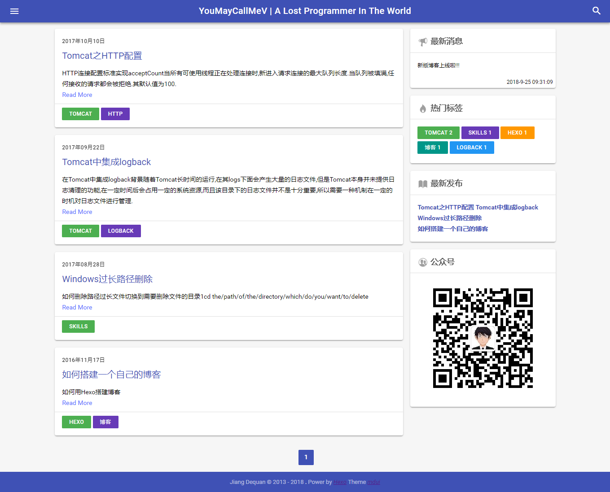

# hexo-theme-mdui
A Material Design [Hexo](https://hexo.io/) theme based on [mdui](https://www.mdui.org/)(Material Design User Interface) a front end.

## Features
* Latest messages
* Hot tags(most used)
* Recently posted articles
* Wechat public number
* About page
* Tags page
* Categories page
* Algolia search
* TOC
* Comment support(Valine)

## Dependencies
The theme depends on the belowing hexo plugins:
* hexo-algolia
* hexo-deployer-git
* hexo-generator-archive
* hexo-generator-category
* hexo-generator-index
* hexo-generator-tag
* hexo-helper-qrcode
* hexo-renderer-ejs
* hexo-renderer-less
* hexo-renderer-marked
* hexo-server

## Configuration
Rename **_config.demo.yml** to **_config.yml** and modify the configurations to what you like.

## Preview
[jiangdequan.github.io](https://jiangdequan.github.io/)

### Screenshot

## Feedback and Questions
You can find the full list of issues at [Issue Tracker](https://github.com/jiangdequan/hexo-theme-mdui/issues). You can submit a [bug or feature suggestion](https://github.com/jiangdequan/hexo-theme-mdui/issues/new).

## License
MIT